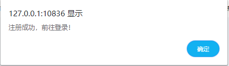
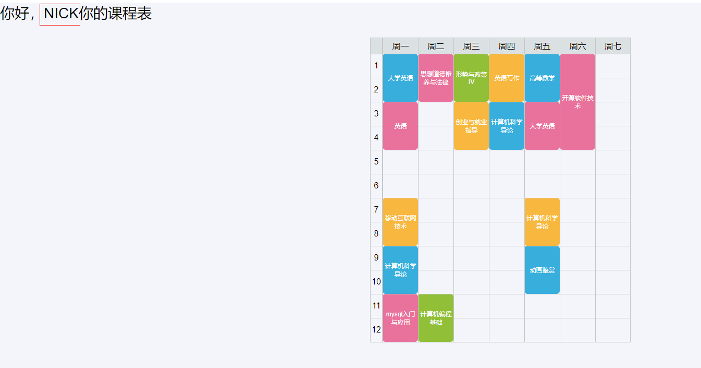

# 项目设计部分：

## 项目总体构成；

## 引入的包在项目中的作用相关说明；

npm install

cnpm install express

mongoose

npm install mongodb

## 项目目录结构和各个部分的说明。

bin文件夹为express框架生生成文件夹，控制端口号

model中存放连接数据库的相关js文件

node_modules中为依赖包

public中存放的是css样式以及引用的美化框架

routes中存放路由文件，控制跳转

schema中存放了数据库集合文件

view中存放了界面文件

# 使用说明书：每个功能的使用方法。

### 注册

注册成功提示

### 登录

账号密码错误时

登录成功

### 我的界面

用户可修改用户名等信息

疫情防控

读取后台数据，生成疫情地图，鼠标悬浮可以显示详情，提醒学术疫情防控趋势

### 记账

许多学生没有记账理财合理消费的习惯，此功能可以帮助学生记录消费情况

点击类别按钮新增消费类型

提交后可在消费记录页查看详情

点击选项可以查看详情

点击删除或者修改记录

可以根据时间筛选记录

### 课表

查看用户课表

### 备忘录功能

点解更改主题可以更换喜欢的颜色

点击日期输入待办事项

## 开发日记

1.搭建框架

2.写路由

3.写页面

4.美化

